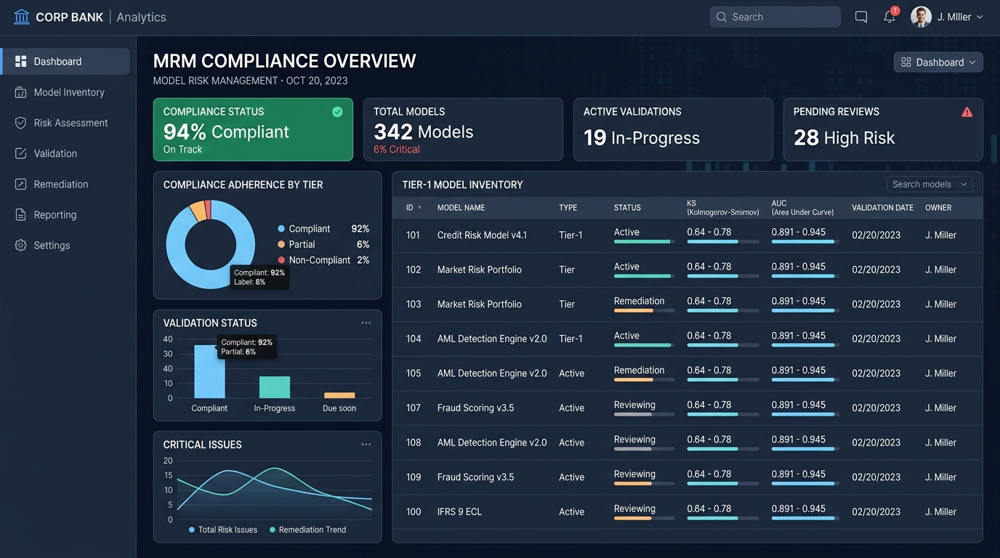
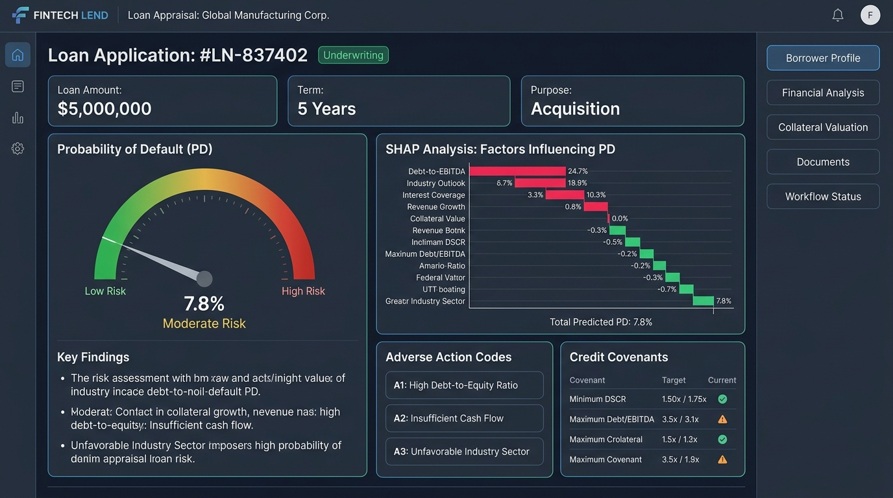
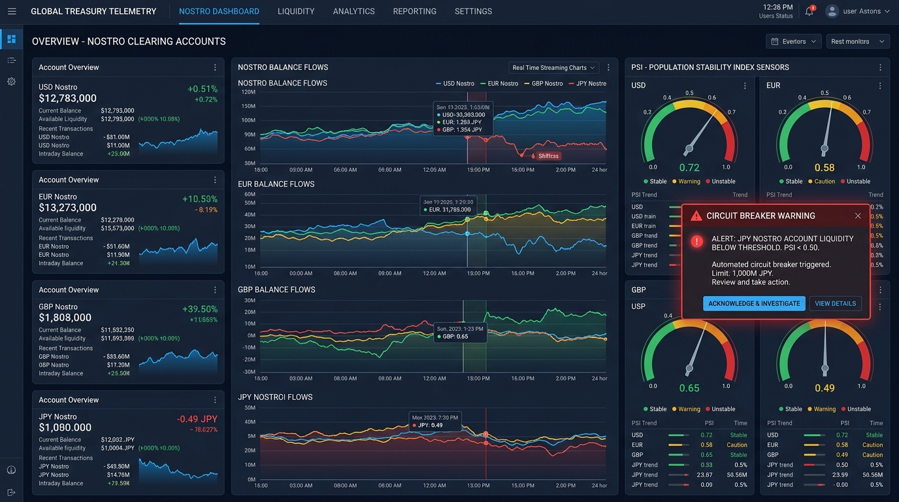
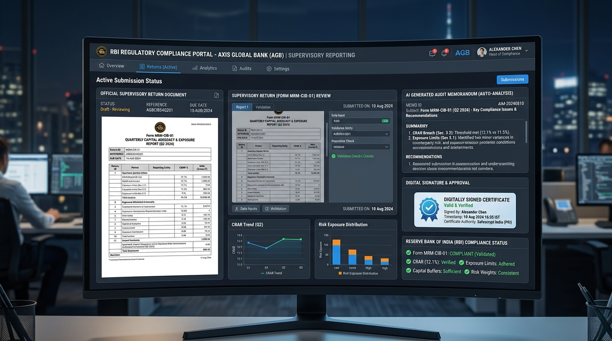

# User Guide & Platform How-To Manual
## RBI Model Risk Management (MRM) Compliance-as-Code Platform
### Institutional Banking Edition

---

## 1. Introduction: What is the Platform?

The **RBI Model Risk Management (MRM) Compliance-as-Code Platform** is an enterprise-grade quantitative risk governance system built for Scheduled Commercial Banks, All-India Financial Institutions (AIFIs), and Tier-1 NBFCs.

Historically, model risk management has been a slow, retrospective audit process relying on manual reviews, static Word/Excel reports, and delayed committee approvals. As banks scale algorithmic lending and real-time treasury management, uncalibrated models or distribution drift can create catastrophic balance sheet exposures before traditional quarterly reviews occur.

This platform introduces **Compliance-as-Code**: codifying regulatory mandates from the Reserve Bank of India (RBI) and Basel III/IV into automated, runtime, and CI/CD validation gates. It guarantees:
1. **Zero-Downtime Governance**: Autonomous circuit breakers and hot challenger failover.
2. **Audit-Ready Explainability**: Deterministic SHAP decomposition and statutory Adverse Action codes on all corporate loans $> ₹50$ Crores.
3. **Continuous Intraday Telemetry**: 15-minute sliding Population Stability Index (PSI) drift monitoring across multi-currency Nostro accounts.
4. **Non-Repudiation**: SHA-256 cryptographic digest sealing across 100% of model scoring events.
5. **Supervisory Automation**: Instant Form MRM-CIB-01 compilation and server-side Gemini AI audit inspection memos.

---

## 2. Quick-Start Guide (5 Steps to Get Familiar)

Follow this 5-minute walkthrough to master the platform:

```
[ Step 1: Switch Personas ] ➔ [ Step 2: Review Model Inventory ] ➔ [ Step 3: Run Credit Appraisal ]
                                                                             |
[ Step 5: File Supervisory Return ]  [ Step 4: Trigger Nostro Drift ] ----+
```

### Step 1: Select Your User Persona
Located in the upper right corner of the navigation bar, click the **Persona Selector** to assume different institutional roles:
* **Chief Risk Officer (CRO)**: Holds full executive sanctioning authority, Tier-1 approval, and Board signature attestation.
* **Lead Independent Model Validator (IMV)**: Certifies model statistical thresholds ($KS \ge 40\%$, $AUC \ge 0.75$) without developer conflict of interest.
* **Wholesale Credit Underwriter**: Originates and appraises high-value corporate loan proposals ($> ₹50$ Crores).
* **Head of Global Treasury**: Manages multi-currency Nostro accounts, sets PSI drift thresholds, and triggers failovers.
* **RBI Supervisory Inspector**: Conducts on-site digital examinations and verifies cryptographic audit blocks.

### Step 2: Inspect Model Blueprints & CI/CD Gates
* Navigate to the **Compliance-as-Code Blueprints** tab.
* Examine the registered models across Tier-1 (Critical), Tier-2 (Substantial), and Tier-3 (Low).
* Note the mandatory **Hot Challenger Binding** for Tier-1 models, ensuring hitless failover capability.

### Step 3: Execute a Corporate Credit Scoring & Review SHAP Explainability
* Navigate to the **Corporate Credit Underwriting** tab.
* Select a corporate loan proposal (e.g. **Tata Power Transmission Ltd** or **Adani Green Energy Ltd**).
* Inspect the **Probability of Default (PD)**, regulatory **Loss Given Default (LGD $\ge 45\%$)**, and the **Deterministic SHAP Waterfall Chart**.
* Review statutory **Adverse Action Codes** (e.g. `RBI-AAC-012` for promoter share encumbrance) and recommended credit covenants.
* Complete the **Four-Eyes Maker-Checker** sanctioning process.

### Step 4: Monitor Cross-Border Nostro Liquidity Drift
* Navigate to the **Cross-Border Nostro Telemetry** tab.
* Observe live 15-minute streaming balances across USD (JPMorgan NY), EUR (Deutsche Bank Frankfurt), GBP (HSBC London), and JPY (MUFG Tokyo).
* Click **Simulate Cross-Border Stress Spike** to induce macroeconomic volatility.
* Watch the **Population Stability Index (PSI)** rise above $0.25$, tripping the autonomous circuit breaker and switching routing to the standby hot challenger model in $< 50$ milliseconds.
* Click **Execute Domestic Reserve Sweep** to restore the Liquidity Coverage Ratio buffer above $110\%$.

### Step 5: Synthesize and Digitally Attest the RBI Supervisory Return
* Navigate to the **RBI Regulatory Returns & AI Auditor** tab.
* Review the automatically aggregated **Form MRM-CIB-01**.
* Click **Synthesize Supervisory Audit Memorandum** to engage the server-side Gemini AI auditor for an objective inspection report.
* Sign in as the Chief Risk Officer and click **Digitally Sign & File Return (CRO)** to cryptographically attest the return.

---

## 3. Visual Tour & Feature Walkthrough

### 3.1 Model Risk Management Cockpit & Inventory Overview


The **Compliance-as-Code Blueprints** view provides the central control panel for model governance:
* **Real-Time Health Meters**: Displays aggregate model inventory, active Champion-Challenger bindings, average KS separation score, and open drift remediation tasks.
* **Declarative CI/CD Gates**: Evaluates models against pre-deployment hurdles ($KS \ge 40\%$, $AUC \ge 0.75$, $Brier \le 0.10$).
* **Out-of-Time (OOT) Stress Benchmarks**: Visualizes model robustness against historical macro shocks.

---

### 3.2 Automated Corporate Lending & SHAP Explainability Engine


The **Corporate Lending** module provides wholesale loan appraisal for facilities $> ₹50$ Crores:
* **LEI & GSTN Verification**: Reconciles reported financials against GST 3B/1 returns and corporate registry filings.
* **Basel III A-IRB Scorer**: Computes Probability of Default and applies the statutory $45\%$ LGD floor.
* **Deterministic SHAP Waterfall**: Unpacks marginal feature impacts in log-odds space. Green bars indicate mitigating factors (e.g. strong Debt Service Coverage Ratio $1.42x$); red bars denote risk-elevating variables (e.g. Promoter Pledge $> 12\%$).
* **Adverse Action Generator**: Emits standardized RBI statutory disclosure notices and prescribes contractual risk covenants.

---

### 3.3 Cross-Border Nostro Liquidity Telemetry & Circuit Breaker


The **Cross-Border Liquidity** console monitors multi-currency clearing accounts:
* **High-Frequency Telemetry**: Ingests SWIFT MT950 intraday statements every 15 minutes across New York, Frankfurt, London, and Tokyo.
* **Sliding-Window PSI Sensors**: Detects empirical distribution shifts against calibrated baseline distributions.
* **Autonomous Circuit Breaker**: Instantly diverts traffic to the pre-calibrated hot challenger when $PSI \ge 0.25$ or $LCR < 100\%$.
* **Automated Domestic Sweep**: Sweeps liquidity from the RBI Standing Liquidity Facility (SLF) to protect intraday settlement obligations.

---

### 3.4 RBI Regulatory Reporting & AI Supervisory Auditor


The **Supervisory Reporting** module automates regulatory compliance returns:
* **Form MRM-CIB-01 Aggregation**: Automatically compiles quarterly inventory changes, validation metrics, drift breaches, and borrower disclosures.
* **Server-Side Gemini AI Auditor**: Generates an inspection-grade audit memorandum evaluating model vulnerabilities, calibration drift, and governance effectiveness.
* **Four-Eyes Digital Attestation**: Enables the Chief Risk Officer to apply a SHA-256 digital signature certifying regulatory truthfulness before submission to the RBI DAKSH supervisory portal.

---

## 4. Role-Based Navigation Matrix

Use this table to understand which views and actions belong to your institutional role:

| In-App Action | Quant (Line 1) | Underwriter (Line 1) | IMV Lead (Line 2A) | Treasury Head (Line 1) | CRO (Line 2B) | RBI Inspector (Line 3) |
|---|---|---|---|---|---|---|
| Register New Model | Yes | No | No | No | No | No |
| Validate / Certify ($KS \ge 40\%$) | No | No | **Yes** | No | No | No |
| Approve Tier-1 Production Model | No | No | No | No | **Yes** | No |
| Prepare Credit Facility | No | **Yes** | No | No | No | No |
| Final Sanction ($> ₹50$ Cr) | No | No | No | No | **Yes (Four-Eyes)** | No |
| Trigger Nostro Drift Simulation | No | No | No | **Yes** | **Yes** | No |
| Execute Domestic Reserve Sweep | No | No | No | **Yes** | **Yes** | No |
| Sign Form MRM-CIB-01 Return | No | No | No | No | **Yes** | No |
| Recompute SHA-256 Audit Hashes | Yes | Yes | Yes | Yes | Yes | **Yes (Full Audit)** |

---

## 5. Frequently Asked Questions (FAQ)

**Q1: Why is my credit sanction button disabled?**
> In compliance with RBI Four-Eyes governance, credit facilities $> ₹50$ Crores cannot be sanctioned unilaterally by a credit underwriter. Switch your persona to **Chief Risk Officer** to execute the second-line checker approval.

**Q2: What happens when the Nostro PSI trips the 0.25 threshold?**
> The system initiates an autonomous failover. Inference requests are rerouted from the Champion model to the standby Challenger model within 42ms. The Challenger applies a $+200$ bps liquidity risk buffer until the primary model is recalibrated.

**Q3: How do examiners verify that audit logs haven't been tampered with?**
> Navigate to the **Cryptographic Telemetry Ledger** tab. Click **Verify Block Integrity**. The platform fetches the raw payload, recomputes the SHA-256 digest in real time, and confirms mathematical equality against the stored digest.

**Q4: How does the AI Supervisory Auditor work?**
> In the **RBI Regulatory Returns** tab, clicking "Synthesize Supervisory Audit Memorandum" sends quarterly telemetry data to the server-side Google Gemini 2.5 model via the `@google/genai` SDK. The model analyzes the metrics and drafts an objective, inspection-grade memorandum formatted for RBI supervisory examination.
